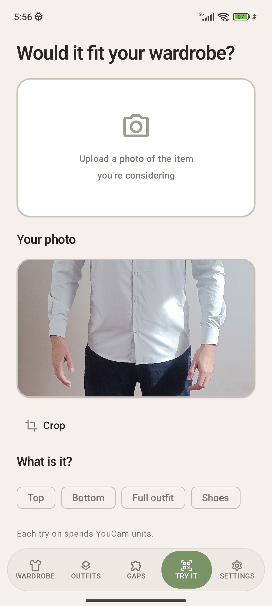
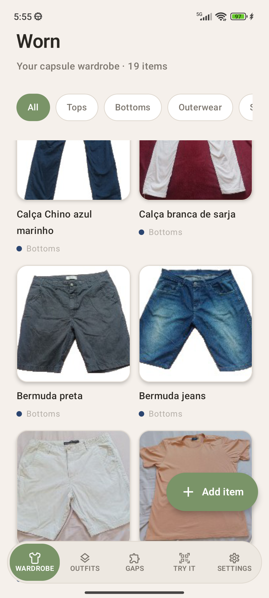
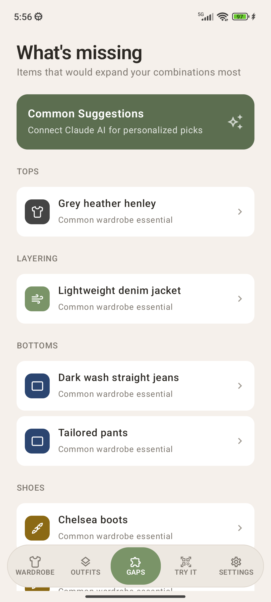
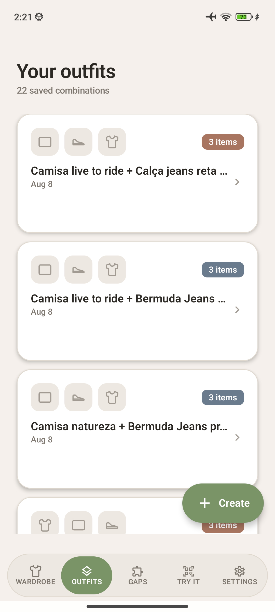
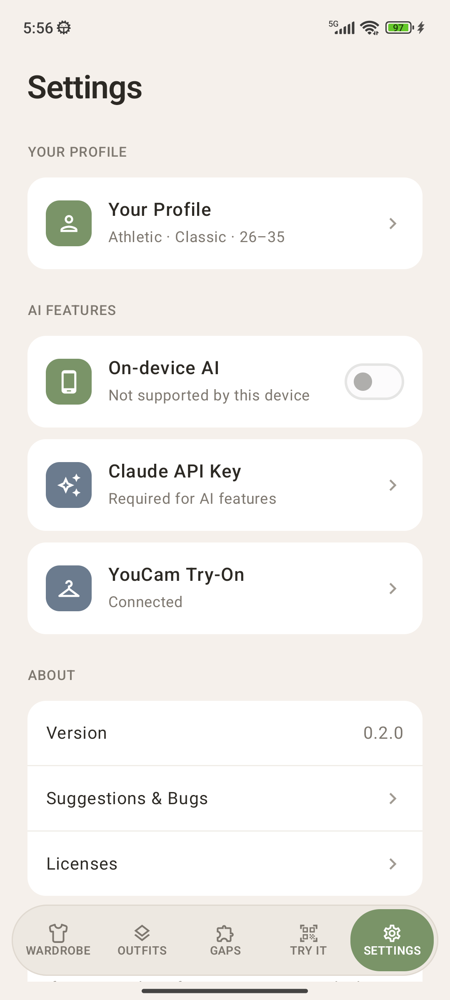

# Worn

**Try it on, and find out whether it fits the closet you already own.**

A wardrobe manager for Android and iOS, built with Kotlin Multiplatform. Worn catalogs what you own, then uses Perfect Corp's **YouCam Apparel Virtual Try-On** to render a garment on you — and Claude to tell you whether that garment is worth buying at all.

---

## The problem

You photograph a jacket in a store, buy it, get home, and discover it pairs with nothing you own. That single moment holds two separate unknowns: *does this look good on me*, and *does this work with what I already have*. Every shopping tool answers at most one of them.

Worn's user is a beginner — someone with a closet full of impulse buys that don't combine, who shops two to four times a year and dreads every trip. He doesn't need more options. He needs to know whether *this one* is a mistake, before he pays for it.

## Demo

<video src="screenshots/try_on.mp4" controls width="320"></video>

▶ [Watch the try-on demo](screenshots/try_on.mp4) — garment photo in, rendered on the user, no store dressing room.

## Screens

| Try It | Wardrobe | Gaps |
|---|---|---|
|  |  |  |
| See a garment on yourself and get a buy/skip verdict | Your catalogued items, auto-tagged from photos | Ranked list of what's missing from your closet |

| Outfits | Settings |
|---|---|
|  |  |
| Saved combinations built from items you own | Profile, on-device AI, and your own API credentials |

---

## Features

### Try It — the two questions, on one screen

Upload a photo of something you're considering. Worn answers both unknowns at once:

**See it on me** sends the garment and your saved full-body photo to the YouCam Apparel VTO API, with a category you pick (Top / Bottom / Full outfit / Shoes), and renders you wearing it.

**Would it fit your wardrobe?** reads your *actual catalogued items* and returns what the garment pairs with, how many new outfit combinations it unlocks, which gap it fills, and a plain **Worth adding** or **Skip this one**.

That pairing is the point. A try-on rendered in isolation tells you the shirt looks fine — it can't tell you that you already own four like it, or that nothing in your closet goes with it. Worn gates the try-on behind a real wardrobe, so the rendered image arrives next to a verdict grounded in what you own. The render answers *how does it look on me*; the catalog answers *should I buy it*. Neither is useful alone at the moment of purchase.

It also has to reach you at that moment. Try It accepts photos straight from the **system share sheet** — share an image out of any shopping app and land directly in the try-on flow — and is exposed as a **launcher shortcut / quick action**, so it works while you're standing in the store, not only when you remember to open the app.

### Wardrobe

Catalog items from the camera or gallery, with a crop editor and automatic **background removal** (ML Kit Subject Segmentation) so a photo taken on a messy bed still produces a clean catalog card. AI auto-tags each item into category, subcategory, color, material, fit, season, and free tags — the manual fields are the fallback, not the default path.

This catalog is what makes everything else contextual. Without it, the try-on is a picture and the gap analysis is a generic listicle.

### Outfits

Named combinations assembled from catalogued items, so a look you worked out once survives past the morning you worked it out.

### Gaps

*What's missing* — the items that would expand your combinations most, ranked, each annotated with how many of your existing items it would pair with. With no AI connected it falls back to a fixed capsule-wardrobe list, so the screen is useful on a fresh install with zero credentials.

### Settings

A style profile (body type, style, lifestyle, age range) that feeds the AI prompts, an on-device AI toggle, and the two credential sheets described below.

---

## How the YouCam integration works

Worn talks to Perfect Corp's YCE server-to-server API at `https://yce-api-01.perfectcorp.com` directly from shared Kotlin — no SDK, no backend of our own. The whole flow lives in [`YouCamApiClient.kt`](shared/src/commonMain/kotlin/com/github/worn/data/source/remote/YouCamApiClient.kt).

1. **Authenticate** — `POST /s2s/v1.0/client/auth`
2. **Request presigned upload slots** — `POST /s2s/{version}/file/{feature}`, then `PUT` the raw JPEG bytes for both the person and the garment
3. **Create the task** — `POST /s2s/{version}/task/{feature}`
4. **Poll** — `GET /s2s/{version}/task/{feature}/{taskId}`, every 2s, up to 60 attempts
5. **Download** the result and hand back raw JPEG bytes

**Auth is RSA, not a bearer secret.** The `id_token` is `client_id=<id>&timestamp=<epochMillis>` encrypted with the user's public key under RSA/PKCS#1 v1.5 and Base64'd; the returned access token is cached for its 2h TTL with a 5-minute refresh margin. Doing that in shared code needed an `expect/actual` pair — and the two platforms disagree about key formats:

- **Android** ([`RsaEncryptor.android.kt`](shared/src/androidMain/kotlin/com/github/worn/util/crypto/RsaEncryptor.android.kt)) — JCA, `RSA/ECB/PKCS1Padding` with `X509EncodedKeySpec`, which consumes the X.509 SPKI key the portal issues as-is.
- **iOS** ([`RsaEncryptor.ios.kt`](shared/src/iosMain/kotlin/com/github/worn/util/crypto/RsaEncryptor.ios.kt)) — Security framework. `SecKeyCreateWithData` wants a PKCS#1 `RSAPublicKey`, *not* SPKI, so this file walks the ASN.1 TLV structure by hand (`stripSpkiHeader`) to unwrap the inner key before importing it.

**Two features, routed by garment category.** Both live under `v2.0` — only the auth handshake is `v1.0`. Tops, bottoms, and full outfits go to `cloth-v3` with `garment_category` set to `upper_body`, `lower_body`, or `full_body`; shoes go to `shoes`, which takes no garment category and instead sends two fixed values: `gender` is always `male` — Worn is an app for men, so that's a product decision rather than a parameter — and `style` is always `random`. Neither is exposed in the UI. One `GarmentCategory` enum drives both the chip the user taps and the feature selection.

HTTP failures are mapped to messages a non-technical user can act on — 401/403 to "check your credentials", 429 to "wait and try again", 5xx to "try again later" — and credentials are never written to logs, only their lengths.

| File | Role |
|---|---|
| [`YouCamApiClient.kt`](shared/src/commonMain/kotlin/com/github/worn/data/source/remote/YouCamApiClient.kt) | Auth, upload, task, poll, download; token cache; error mapping |
| [`YouCamApiModels.kt`](shared/src/commonMain/kotlin/com/github/worn/data/source/remote/YouCamApiModels.kt) | Request/response DTOs |
| [`TryOnRepositoryImpl.kt`](shared/src/commonMain/kotlin/com/github/worn/data/repository/TryOnRepositoryImpl.kt) | Loads the saved model photo, orchestrates the call, returns `Result<ByteArray>` |
| [`RsaEncryptor.kt`](shared/src/commonMain/kotlin/com/github/worn/util/crypto/RsaEncryptor.kt) | `expect` declaration + the two platform actuals |

---

## Setup — bring your own keys

No credentials are baked into the build. Every AI feature is opt-in, and the app is fully usable as a plain wardrobe catalog with none of them.

| Feature | Credential | Where |
|---|---|---|
| Virtual try-on | YouCam `client_id` + `client_secret` from [yce.perfectcorp.com](https://yce.perfectcorp.com) | Settings → AI Features → YouCam Try-On |
| Auto-tagging, gaps, Try It analysis | Anthropic API key | Settings → AI Features → Claude API Key |
| Same, offline and free | none — uses the device's own model | Settings → AI Features → On-device AI |

Two things the YouCam portal doesn't make obvious:

- The **shorter** value is the API key (`client_id`); the **longer** one is the secret key.
- Paste the secret **without** the `-----BEGIN PUBLIC KEY-----` / `-----END PUBLIC KEY-----` lines.

Credentials are checked against the server with a live auth handshake *before* they're saved, so a typo fails in Settings rather than halfway through your first try-on.

## Privacy

- Photos live in **app-private internal storage** — no gallery writes, no storage permission, no external app access.
- Secrets go to the **Android Keystore** (AES/GCM-encrypted file) or the **iOS Keychain** — never DataStore, never plaintext, never logged.
- All network traffic is HTTPS.
- Nothing leaves the device unless you invoke a feature backed by a credential you supplied. With on-device AI enabled, analysis never leaves the device at all.

---

## Development

### Architecture

MVI + Repository, with no Use Cases layer — business logic lives in the repository implementations, which orchestrate the database, photo storage, and the AI/try-on clients in one testable place. ViewModels are thin: intent in, state and effects out. See [ARCHITECTURE.md](./ARCHITECTURE.md).

### Tech stack

| Library | Version | Purpose |
|---|---|---|
| Kotlin Multiplatform | 2.3.21 | Shared logic across Android + iOS |
| Compose Multiplatform | 1.11.1 | Android UI (iOS is native SwiftUI) |
| kotlinx-coroutines | 1.11.0 | Async / Flow |
| Ktor | 3.5.1 | HTTP client (Claude + YouCam) |
| kotlinx-serialization | 1.11.0 | JSON |
| SQLDelight | 2.3.2 | Local database |
| Koin | 4.2.2 | Dependency injection |
| Coil | 3.5.0 | Image loading |
| AndroidX DataStore | 1.2.1 | Key-value storage (non-secret) |
| ML Kit GenAI Prompt | 1.0.0-beta2 | On-device AI |
| ML Kit Subject Segmentation | 16.0.0-beta1 | Background removal |
| Turbine · MockK · ktor-client-mock | 1.2.1 · 1.14.11 | Testing |
| Detekt | 2.0.0-alpha.5 | Static analysis |

AGP 9.3.1 · `minSdk` 29 · `targetSdk` 36 · JDK 17+.

### Project structure

```
root/
├── composeApp/            # Android application module (Compose UI)
├── iosApp/                # iOS app (Xcode/SwiftUI) + WornShareExtension
├── shared/                # KMP shared module
│   └── src/
│       ├── commonMain/
│       │   ├── domain/{model,repository}
│       │   ├── data/
│       │   │   ├── repository/          # business logic
│       │   │   └── source/{local,remote,ai,image}
│       │   ├── presentation/viewmodel/  # MVI
│       │   ├── util/{secret,image,crypto}
│       │   ├── di/
│       │   └── sqldelight/              # .sq schemas
│       ├── androidMain/                 # Keystore, ML Kit, OkHttp, JCA
│       ├── iosMain/                     # Keychain, Darwin, Security framework
│       ├── commonTest/                  # ViewModel tests + fakes
│       └── androidHostTest/             # repository & client tests
├── journeys/              # XML end-to-end journey specs
├── design/                # design source + persona
└── screenshots/
```

### Build & run

```shell
# Android debug APK
./gradlew :composeApp:assembleDebug

# Shared module tests
./gradlew :shared:allTests

# Static analysis
./gradlew detekt
```

For iOS, open `iosApp/` in Xcode and run.

End-to-end UI journeys live in [`journeys/`](journeys/README.md) as XML specs driven by the `android` CLI.

---

## Buy Me New Socks

If Worn saved you from wearing mismatched socks, consider a tiny Bitcoin tip via Lightning Network:

```
jvsena42@blink.sv
```
